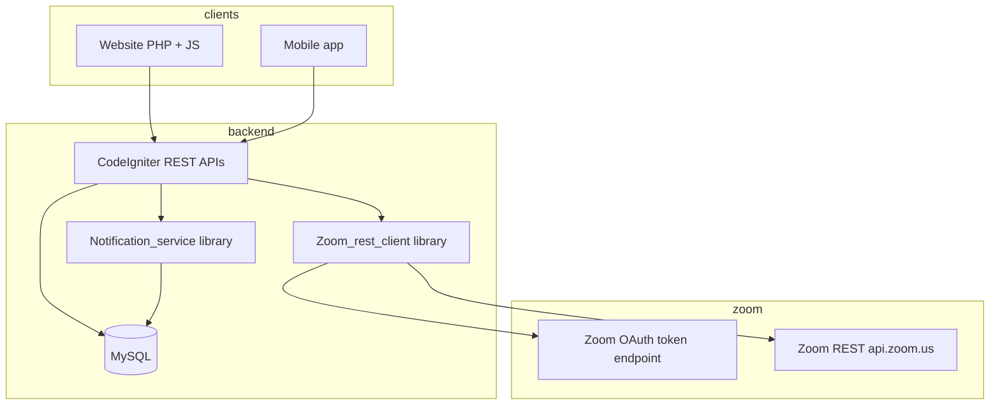

# Zoom + notifications — architecture (Education / Gradmo)

This document matches the implementation in the repo: **Server-to-Server (S2S) Zoom REST**, **`batch_zoom_meetings`** storage, **secured batch APIs**, **`Notification_service`** for DB fan-out, and the existing **website live room** (`batch/live-room` + `api/batch/live-class-details`).

---

## 1. High-level architecture



- **Single API layer** for website and mobile: Bearer `access_token` from `api/user/login` (same as today).
- **Zoom**: backend holds **S2S credentials** and creates meetings; clients receive **`join_url`** / passcode (never store raw client secret in apps).
- **Embedded web meeting** (optional): uses **Meeting SDK** + short-lived **signature** (existing `zoom_signature` + SDK key/secret from `live_class_setting`); **in-browser join** for everyone is usually **`join_url`** (Zoom client or browser).

---

## 2. Zoom: SDK vs Web SDK (Meeting SDK)

| Approach | Best for | Notes |
|----------|----------|--------|
| **Join URL (`join_url`)** | Website + mobile, fastest to ship | Opens Zoom app or browser; same URL from REST create meeting. |
| **Zoom Meeting SDK (embedded)** | Custom in-page UI | Needs **SDK Key/Secret** (or OAuth-based SDK credentials per Zoom’s current docs). You already load embedded SDK in `application/views/frontend/batch_live_room.php`. |
| **Zoom Video SDK** | Full custom video UI | Different product; heavier. |

**Recommendation:** Use **`join_url` from REST** as the **primary** path for both website and mobile. Keep embedded SDK as **optional** for web-only polish once SDK credentials are aligned with Zoom’s current auth model (JWT deprecation in favor of OAuth/SDK app types).

---

## 3. Database schema (implemented / suggested)

### 3.1 `batch_zoom_meetings` (installed via SQL)

File: `installer/create_batch_zoom_meetings_and_zoom_s2s.sql`

Stores **one active Zoom meeting per batch** (soft-delete with `status = 0`). Key fields:

- `batch_id`, `zoom_meeting_id`, `join_url`, `start_url`, `password`, `host_id`, `topic`, `agenda`, `start_time`, `duration`, `timezone`, `meeting_type`, `status`, `raw_json`, audit columns.

### 3.2 `zoom_logs` (optional audit)

Same SQL file: `action`, `http_status`, `message`, JSON payloads, `user_uid`, `user_ut`.

### 3.3 `zoom_api_credentials` (extended)

Columns added (S2S + host resolution):

- `s2s_account_id`, `s2s_client_id`, `s2s_client_secret` — **Server-to-Server OAuth** app from Zoom Marketplace.
- `zoom_host_email` — licensed Zoom user who owns meetings (used with `GET /users/email:...`).
- `zoom_host_user_id` — optional cache of Zoom `user id`.

Token cache file (writable): `application/cache/zoom_s2s_token.json` (created at runtime).

### 3.4 Existing `notifications` table

Used by `api/main/notifications-list`. Rows are **per student** (`student_id`, `batch_id`, `notification_type`, `msg`, `url`, …).

**Future (teacher / institute in same feed):** add nullable `recipient_user_id` + `recipient_user_type` or a separate `teacher_notifications` table — not required for the current fan-out helper.

---

## 4. REST API structure (implemented)

All use **JSON body or form** + header `Authorization: Bearer <access_token>` unless noted.

| Method / route | Auth | Purpose |
|----------------|------|---------|
| `POST/GET api/batch/batch-zoom-details` | student, teacher, institute | Sanitized Zoom row; **no `startUrl` for students**. |
| `POST api/batch/batch-zoom-join` | same | Alias of **batch-zoom-details** (validated “join” contract). |
| `POST api/batch/batch-zoom-create` | teacher, institute | Creates meeting on Zoom + inserts `batch_zoom_meetings`. |
| `POST api/batch/batch-zoom-update` | teacher, institute | `PATCH` meeting on Zoom + local metadata. |
| `POST api/batch/batch-zoom-delete` | teacher, institute | Deletes meeting on Zoom + sets `status=0`. |
| `POST api/batch/batch-notify-students` | teacher, institute | Fan-out notifications to `student_batchs` enrollments. |
| `POST/GET api/batch/live-class-details` | token (existing) | Returns session + **merged** Zoom join data if `batch_zoom_meetings` exists. |

**Access rules (reused from codebase):**

- **Student:** `student_batchs` enrollment for `batch_id`.
- **Teacher:** `batch_subjects.teacher_id` for `batch_id`.
- **Institute:** `batches.admin_id` equals institute user id.

---

## 5. Example API responses

### `api/batch/batch-zoom-details` (success)

```json
{
  "status": "true",
  "msg": "Success",
  "data": {
    "zoom": {
      "batchId": 6,
      "zoomMeetingId": "12345678901",
      "joinUrl": "https://zoom.us/j/12345678901?pwd=...",
      "password": "abc123",
      "topic": "Batch 6 — Live class",
      "startTime": null,
      "duration": 60,
      "timezone": "Asia/Kolkata"
    }
  }
}
```

Teacher/institute responses also include `startUrl` and `hostId`.

### `api/batch/batch-notify-students`

Request:

```json
{
  "batch_id": 6,
  "notification_type": "live_class",
  "msg": "Math class starts in 15 minutes",
  "url": "batch/live-classes?batch_id=6"
}
```

Response:

```json
{
  "status": "true",
  "msg": "Notifications saved",
  "data": { "inserted": 42 }
}
```

---

## 6. Website flow (already wired)

1. Student opens **Live classes**: `batch/live-classes?batch_id=…` → `api/batch/live-class-list`.
2. Clicks **Join** → `batch/live-room?live_class_id=…` → `api/batch/live-class-details`.
3. **`live_class_details`** now, if `batch_zoom_meetings` has an active row, overrides **`join_url` / password / meeting id** for Zoom links and refreshes the embedded SDK signature when SDK keys exist in `live_class_setting`.

Admin UI for “link Zoom to batch” can call **`batch-zoom-create`** from the admin/institute panel in a follow-up.

---

## 7. Security practices

- **Never** return Zoom **S2S client secret** in any API response.
- **Do not** expose **`start_url`** to students (only host-capable roles).
- **Always** enforce batch access on every Zoom endpoint (implemented).
- **Rotate** S2S credentials in Zoom Marketplace if leaked; delete `application/cache/zoom_s2s_token.json` after rotation.
- **Rate-limit** `batch-zoom-create` at reverse proxy if needed.

---

## 8. Notifications — common usage

**Library:** `application/libraries/Notification_service.php`

- `fan_out_batch_students($batch_id, $notification_type, $msg, $url)`
- `notify_student($student_id, $batch_id, $notification_type, $msg, $url)`

**Controller helper (any controller extending `MY_Controller`):**

```php
$n = $this->save_batch_student_notifications(
    $batch_id,
    'live_class',
    'Class starts at 10:00',
    'batch/live-classes?batch_id=' . $batch_id
);
```

**HTTP API:** `api/batch/batch-notify-students` (teacher/institute).

**Push (FCM):** your existing `firebase_key` + helpers in `Ajaxcall` can be invoked **after** DB insert in one wrapper later; keep DB writes in `Notification_service` as the source of truth.

---

## 9. Recommended PHP folder layout (incremental)

```
application/
  controllers/api/batch/Batch.php   # batch + live class + zoom endpoints
  libraries/
    Zoom_rest_client.php            # OAuth + REST
    Notification_service.php      # DB notifications
  core/MY_Controller.php            # save_batch_student_notifications()
installer/
  create_batch_zoom_meetings_and_zoom_s2s.sql
```

Optional later: `application/controllers/api/zoom/Zoom.php` if Zoom surface grows beyond batch scope.

---

## 10. Operational checklist

1. Run **`installer/create_batch_zoom_meetings_and_zoom_s2s.sql`** on production DB.
2. In Zoom Marketplace: create **Server-to-Server OAuth** app; copy Account ID, Client ID, Secret; scopes (adjust to least privilege):
   - Meetings: `meeting:write:admin`, `meeting:read:admin`
   - Host: `user:read:admin` (or set `zoom_host_user_id` in DB and skip email lookup)
   - **Recorded meetings page:** `cloud_recording:read:recording:admin` (required); `cloud_recording:read:list_user_recordings:admin` (optional fallback)
   - Host join ZAK (live room): `user:read:token:admin`
   After scope changes: **Activate** the app and delete `application/cache/zoom_s2s_token.json`.
3. Fill **`zoom_api_credentials`** row: `s2s_*` + **`zoom_host_email`** (licensed user).
4. Call **`api/batch/batch-zoom-create`** for each batch (or build admin UI).
5. Test **live-class-details** join links on web; mobile uses same APIs.

---

## 11. Extra features (roadmap)

| Feature | Suggestion |
|---------|------------|
| Meeting status Live/Upcoming/Ended | Derive from `live_class_history.end_time` + Zoom webhook `meeting.started` / `meeting.ended` → update DB. |
| Reminders before class | Cron hits batches with next class time → `save_batch_student_notifications` + FCM. |
| Recordings | Zoom cloud recording webhook → store `recording_files` URLs per `live_class_id`. |
| Auto expiry | Use scheduled meeting type + Zoom `end_times` or delete via cron when class row ends. |

Webhook endpoint can be a new unauthenticated route with **Zoom signature verification** (secret token in `general_settings`).
